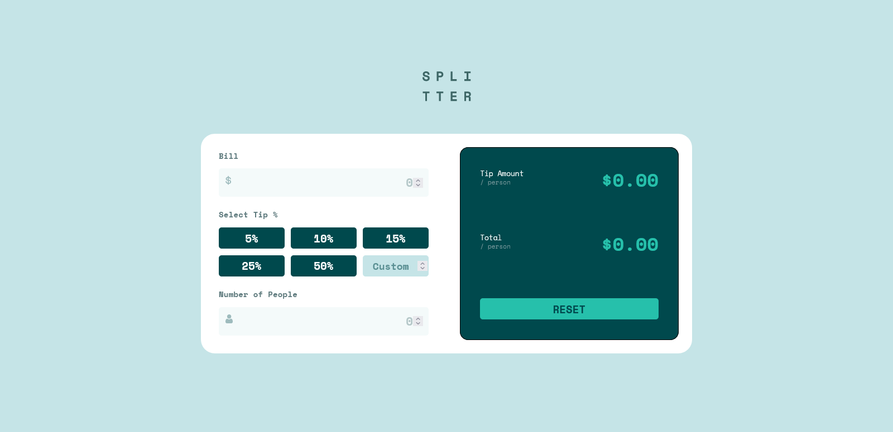

# Frontend Mentor - Tip calculator app solution

This is a solution to the [Tip calculator app challenge on Frontend Mentor](https://www.frontendmentor.io/challenges/tip-calculator-app-ugJNGbJUX).

## Table of contents

- [Overview](#overview)
  - [The challenge](#the-challenge)
  - [Screenshot](#screenshot)
  - [Links](#links)
- [My process](#my-process)
  - [Built with](#built-with)
  - [What I learned](#what-i-learned)
- [Author](#author)

## Overview

### The challenge

Users should be able to:

- View the optimal layout for the app depending on their device's screen size
- See hover states for all interactive elements on the page
- Calculate the correct tip and total cost of the bill per person

### Screenshot

### Links

- Solution URL: [Add solution URL here](https://your-solution-url.com)
- Live Site URL: [Add live site URL here](https://your-live-site-url.com)

## My process

### Built with

- Semantic HTML5 markup
- CSS custom properties
- Flexbox
- CSS Grid
- Mobile-first workflow

### What I learned

I learned that you should use the correct html element for the correct reason - for example I first had the tip amount and the total areas as inputs - I thought this would be a good idea as I could then have a placeholder and for a few other reasons that seem to me to be valid at the time - but then the problems starting arising and it was kindly pointed out to me that as they aren't input areas they shouldn't use an input tag. Wise advice.
I also had a go at using CSS custom properties with the colours which seems to work well and makes for easy adjustments as and when desired/required.
I also learnt the difference betweeen 0 == '0' and 0 === '0', as in the first one will equate to true, whereas the strict equals won't - this was important when checking if the number of people was 0 or not.

## Author

- Website - [Add your name here](https://www.your-site.com)
- Frontend Mentor - [@emjogale](https://www.frontendmentor.io/profile/emjogale)
- Twitter - [@emmagale2635](https://www.twitter.com/emmagale2635)
